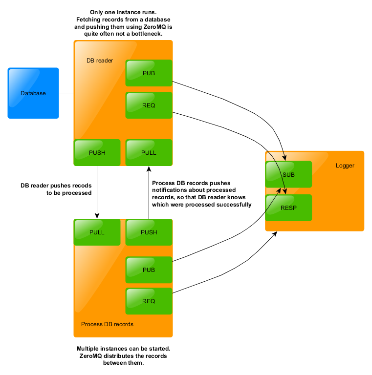

# Design



# How to buid and run using Docker

Use following commands to build and run a docker container with the zeromq
examples built and ready to be run

```bash
docker build --rm -t local/zeromq_examples
docker run --rm -ti local/zeromq_examples
```


